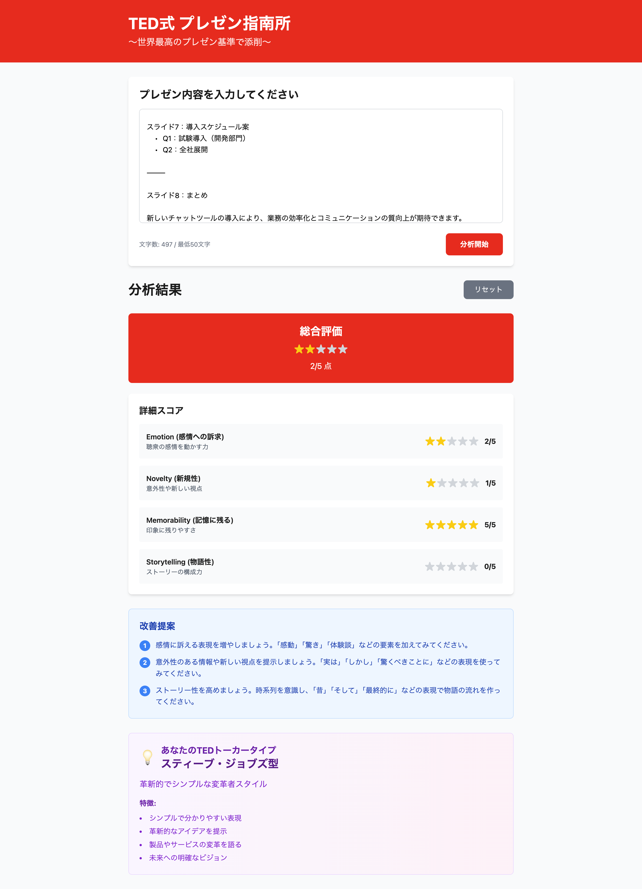

# TED式 プレゼン指南所

世界最高のプレゼン基準で添削するWebアプリケーション



## 🎯 コンセプト

TEDトークで使われる効果的なプレゼンテーション技法を分析し、あなたのプレゼン内容を4つの重要な観点から評価・改善提案を行います。

## 🌟 主な機能

### 📊 4つの評価軸
- **Emotion（感情への訴求）**: 聴衆の感情を動かす力
- **Novelty（新規性）**: 意外性や新しい視点
- **Memorability（記憶に残る）**: 印象に残りやすさ
- **Storytelling（物語性）**: ストーリーの構成力

### 🎭 TEDトーカー診断
あなたのプレゼンスタイルを4つの著名なTEDスピーカータイプで診断：

- **サイモン・シネック型**: WHYから始める理念重視スタイル
- **スティーブ・ジョブズ型**: 革新的でシンプルな変革者スタイル  
- **エイミー・カディ型**: 科学的根拠に基づく実証的スタイル
- **ブレネー・ブラウン型**: 脆弱性と勇気を語る共感型スタイル

### 💡 改善提案
低スコア項目に基づいた具体的なアドバイスを提供

## 🛠 技術構成

- **フレームワーク**: Next.js 14 (App Router)
- **言語**: TypeScript
- **スタイリング**: Tailwind CSS
- **UI**: React Components

## 📁 プロジェクト構造

```
src/
├── app/
│   ├── globals.css         # グローバルスタイル
│   ├── layout.tsx          # アプリケーションレイアウト
│   └── page.tsx            # メインページ
├── components/
│   ├── InputForm.tsx       # 入力フォームコンポーネント
│   ├── ScoreDisplay.tsx    # スコア表示コンポーネント
│   ├── SuggestionCard.tsx  # 改善提案コンポーネント
│   └── SpeakerType.tsx     # TEDトーカー診断コンポーネント
├── data/
│   ├── keywords.ts         # 評価キーワード辞書
│   └── speakers.ts         # TEDスピーカータイプ定義
└── utils/
    └── analyzer.ts         # プレゼン分析ロジック
```

## 🚀 セットアップ

### 必要要件
- Node.js 18以上
- npm または yarn

### インストール

```bash
# 依存関係のインストール
npm install

# 開発サーバー起動
npm run dev
```

アプリケーションは http://localhost:3000 で起動します。

### ビルド

```bash
# プロダクションビルド
npm run build

# プロダクションサーバー起動
npm start
```

## 🎨 デザインテーマ

TEDの象徴的な赤色（#e62b1e）をメインカラーとした、シンプルで洗練されたデザイン。

## 📈 使用方法

1. **入力**: プレゼン内容をテキストエリアに入力（最低50文字）
2. **分析**: 「分析開始」ボタンをクリック
3. **結果確認**: 
   - 総合評価と詳細スコア（1-5星評価）
   - 改善提案
   - あなたのTEDトーカータイプ診断
4. **改善**: 提案に基づいてプレゼンを改良

## 🔍 分析ロジック

キーワードマッチング方式で各カテゴリのスコアを算出：
- **高スコアキーワード**: 3点
- **中スコアキーワード**: 1点
- **最終スコア**: 合計点数を1-5星に変換

## 🎪 開発方針

プロトタイプ重視 - シンプルで雑でも動作することを優先

## 📝 ライセンス

MIT License