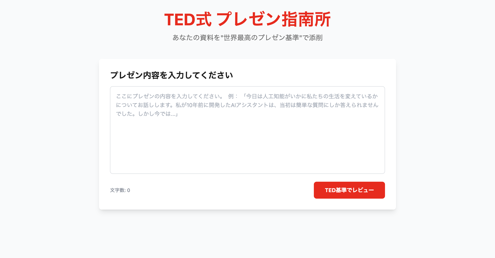
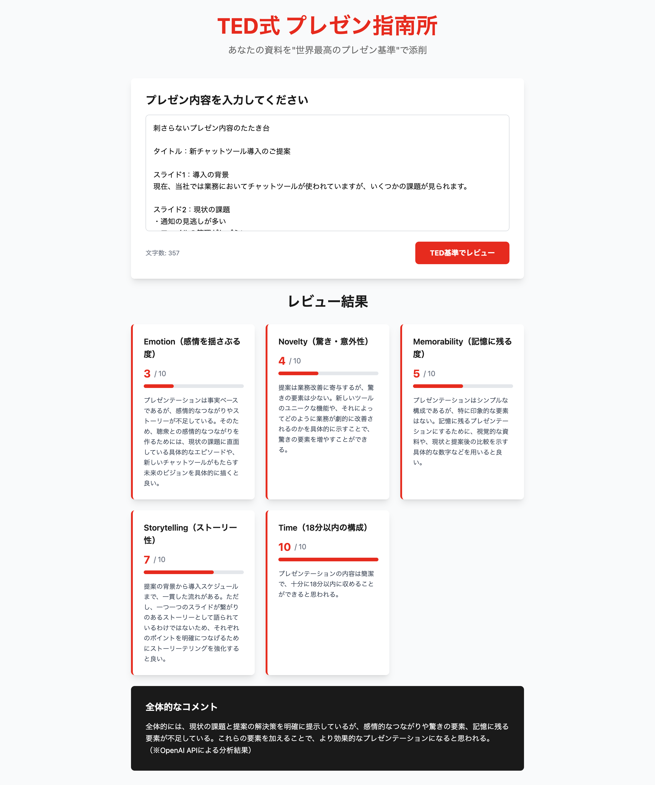

# TED式 プレゼン指南所

<div align="center">
  
</div>

> あなたの資料を"世界最高のプレゼン基準"で添削

**TED式 プレゼン指南所**は、あなたのプレゼン内容をTEDトークの手法に沿ってAIが自動レビューし、「伝わる・響く・覚えてもらえる」プレゼンにブラッシュアップするWebアプリケーションです。

## ✨ 特徴

- 🎯 **TED基準の5つの観点**でプレゼンを評価
- 🤖 **OpenAI GPT-4**による高精度な分析
- 📊 **スコア化とフィードバック**で改善点を明確化
- 🛡️ **フォールバック機能**でAPIエラー時も継続利用可能
- 🎨 **TED風デザイン**で統一感のあるUI

## 🎭 レビュー観点

プレゼン内容を以下の5つの観点で1-10点評価します：

1. **Emotion（感情を揺さぶる度）** - 聴衆の心に響く内容かどうか
2. **Novelty（驚き・意外性）** - 新しい視点や驚きがあるか
3. **Memorability（記憶に残る度）** - 印象的で覚えやすい内容か
4. **Storytelling（ストーリー性）** - 物語として構成されているか
5. **Time（18分以内の構成）** - TED流の時間感覚に適しているか

<div align="center">
  
  <p><em>実際のレビュー結果表示画面</em></p>
</div>

## 🚀 使い方

1. **プレゼン内容を入力** - テキストエリアにあなたのプレゼン内容を記載
2. **「TED基準でレビュー」ボタンをクリック** - AIが自動分析を開始
3. **結果を確認** - 5つの観点別スコアと具体的な改善提案を確認
4. **プレゼンを改善** - フィードバックを参考にプレゼンをブラッシュアップ

## 🛠️ 技術スタック

- **フレームワーク**: Next.js 14 (App Router)
- **言語**: TypeScript
- **スタイリング**: Tailwind CSS
- **AI**: OpenAI GPT-4 API
- **デプロイ**: Vercel対応

## 📦 セットアップ

### 1. リポジトリのクローン

```bash
git clone https://github.com/your-username/ted-presentation-advisor.git
cd ted-presentation-advisor
```

### 2. 依存関係のインストール

```bash
npm install
```

### 3. 環境変数の設定

`.env.local`ファイルを作成し、OpenAI APIキーを設定：

```bash
# OpenAI API設定
OPENAI_API_KEY=your_openai_api_key_here
```

> **Note**: APIキーが設定されていない場合、自動的にモックデータでデモンストレーションできます。

### 4. 開発サーバーの起動

```bash
npm run dev
```

ブラウザで [http://localhost:3000](http://localhost:3000) を開いて確認してください。

## ⚙️ 利用可能なスクリプト

```bash
npm run dev      # 開発サーバー起動
npm run build    # プロダクションビルド
npm run start    # プロダクションサーバー起動
npm run lint     # ESLint実行
```

## 🏗️ アーキテクチャ

```
┌─────────────────┐    ┌──────────────────┐    ┌─────────────────┐
│   フロントエンド    │────│   API Route      │────│   OpenAI API    │
│   (Next.js)     │    │   (/api/review)  │    │   (GPT-4)       │
└─────────────────┘    └──────────────────┘    └─────────────────┘
                              │
                       ┌──────────────────┐
                       │   モックデータ     │
                       │   (フォールバック) │
                       └──────────────────┘
```

### 処理フロー

1. **APIキー確認** - 環境変数でOpenAI APIキーの有無をチェック
2. **OpenAI API呼び出し** - キーが有効な場合はGPT-4でレビュー実行
3. **自動フォールバック** - API失敗時はモックデータで継続動作
4. **結果表示** - 5つの観点別スコアとフィードバックを画面に表示

## 📝 プロトタイプについて

このプロジェクトは**プロトタイプ開発**をメインとしており、以下の方針で開発されています：

- ✅ **シンプルな実装** - 複雑な機能より動作を優先
- ✅ **高速開発** - 完璧さよりスピード重視
- ✅ **実用性重視** - 実際に使える機能に絞り込み

## 🤝 貢献

プロジェクトへの貢献を歓迎します！

1. フォークする
2. フィーチャーブランチを作成 (`git checkout -b feature/amazing-feature`)
3. 変更をコミット (`git commit -m 'Add amazing feature'`)
4. ブランチにプッシュ (`git push origin feature/amazing-feature`)
5. プルリクエストを作成

## 📄 ライセンス

このプロジェクトはMITライセンスの下で公開されています。詳細は [LICENSE](LICENSE) ファイルを参照してください。

## 🙏 謝辞

- [TED Talks](https://www.ted.com/) - 世界最高のプレゼンテーション基準の提供
- [OpenAI](https://openai.com/) - 高精度なAI分析機能の提供
- [Next.js](https://nextjs.org/) - 優れた開発体験の提供

---

<div align="center">
  <p>Made with ❤️ for better presentations</p>
  <p>あなたのプレゼンを世界レベルに引き上げましょう！</p>
</div>